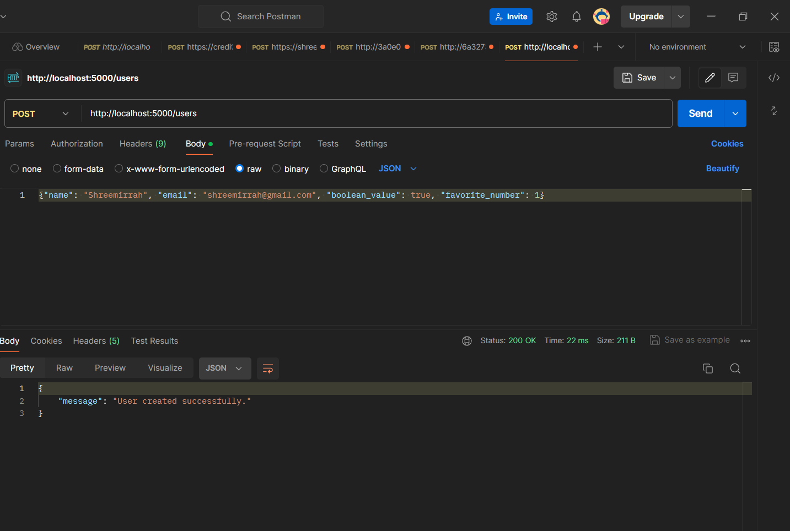
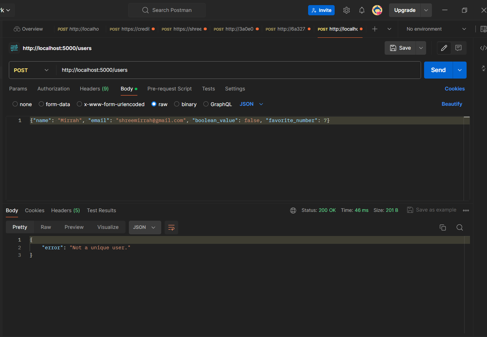
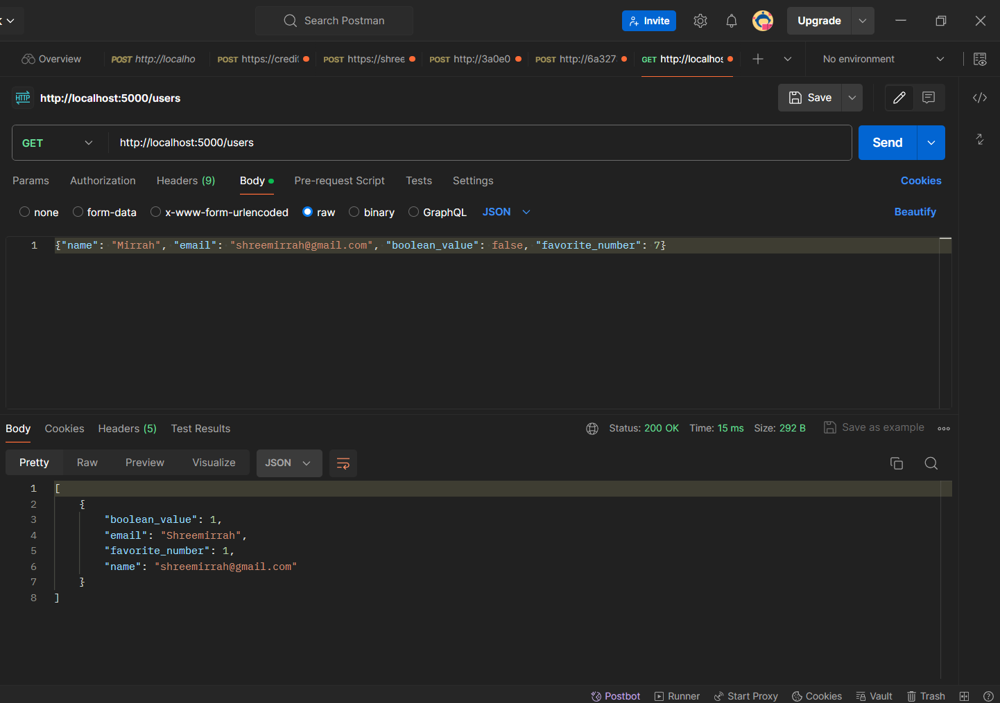

### User Entry Application is a simple backend functionality implementation for the given problem Statement:
Develop an application that captures and stores user data: email, a Boolean value, and a favorite number.
Ensure the system can identify and prevent duplicate entries.

### First thoughts and approach
A unique user is identified by 
1. A unique email ID.
2. A unique set of Name, Boolean and Favorite number values.

### Teck stack:
1. Prgoramming Langauge: Python
2. Library: sqlite
3. Web framework: Flask

### Implementation:
Step 1: 
Run the following command in terminal

##### python user_entry.py

Step 2:
Open the browser and enter the following URL:
##### http://127.0.0.1:5000/users

Step 3:
Open Postman:
1. Create a POST request:
##### {"name": "Shreemirrah", "email": "shreemirrah@gmail.com", "boolean_value": true, "favorite_number": 1}

2. Create a POST request to check the result on duplication of the E-Mail value:
##### {"name": "Mirrah", "email": "shreemirrah@gmail.com", "boolean_value": false, "favorite_number": 7}

3. Create a GET request:
